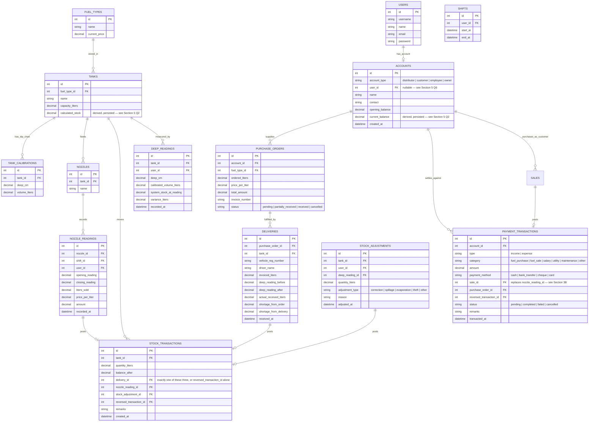
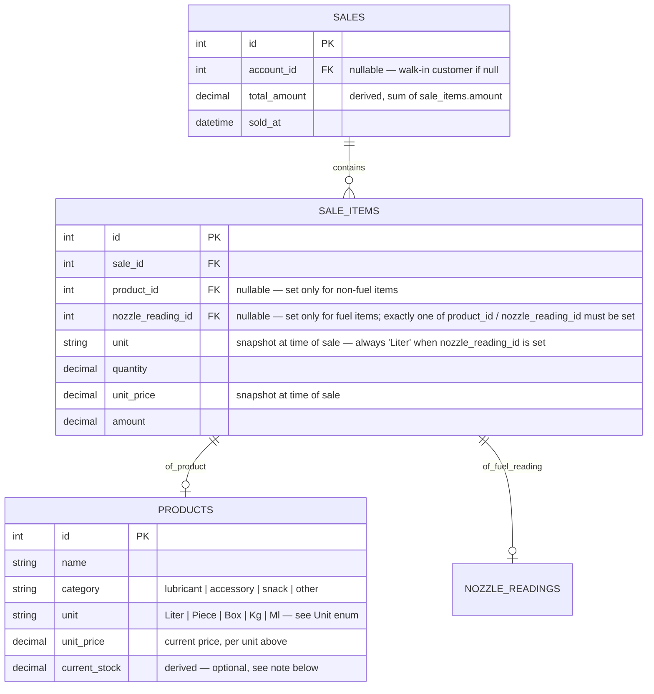

# Fuel Station OS - Planning & Architecture (Laravel + NativePHP Rewrite)

Per your instructions, we are completely restarting the project with a new technology stack and a robust append-only ledger architecture. All previous Node.js/TypeScript code will be deleted before execution begins.

## Change Log

* **v1** — Original plan: Tech stack, Append-Only Ledger architecture, initial ERD (fuel + payment ledgers only), phased execution plan.
* **v2 (this version)** — Added **Section 3B: Sales & Products** to support non-fuel items (lubricants, accessories, etc.) alongside fuel sales. Replaced `payment_transactions.nozzle_reading_id` with `payment_transactions.sale_id`. Resolved all six Phase 2 open questions raised during implementation (see Section 5).

---

## 1. Technology Stack

* **Backend API & Business Logic:** Laravel 11.
* **Desktop Wrapper:** NativePHP with Tauri adapter.
* **Frontend:** Nuxt.js (Vue 3) communicating with Laravel via API.
* **Database:** SQLite (embedded via NativePHP).
* **Authentication:** Laravel Sanctum.
* **Authorization:** `spatie/laravel-permission` (Admin, Manager, Staff roles).

---

## 2. Append-Only Ledger Architecture

The core of this rewrite is the strict enforcement of **Append-Only Ledgers** for both Fuel Inventory and Financial Payments.

1. **Stock Transactions (`stock_transactions`)**: The single source of truth for fuel inventory.
   * `tanks.calculated_stock` is never updated directly by forms. It is derived from summing all transaction quantities for that tank, and is persisted (see Section 5, Q2) — updated by application-layer service/observer logic within the same DB transaction as the ledger insert.
   * Modifying an entry is done by posting a reversing transaction (negative equivalent) linked via `reversed_transaction_id` and creating a new corrected entry.
   * Exactly one of `delivery_id`, `nozzle_reading_id`, `stock_adjustment_id` must be set on a normal entry. A reversal entry sets **only** `reversed_transaction_id`, leaving the other three null.
2. **Payment Transactions (`payment_transactions`)**: The single source of truth for money movement.
   * Accounts (Distributors, Customers, Employees, Owner) have their `current_balance` derived entirely from linked payment transactions — also persisted, same update discipline as above.
   * Revenue no longer links directly to `nozzle_reading_id`. It links to `sale_id` (see Section 3B) — this makes the ledger agnostic to whether the sale was fuel, a non-fuel product, or both.
   * A manual payment (e.g. salary, utility expense) may have `sale_id` and `purchase_order_id` both null — this is valid, not an error.
   * Reversal entries set **only** `reversed_transaction_id`.

---

## 3. Entity-Relationship Diagram (ERD) — Core Ledger

---

## 3B. Sales & Products (v2 addition)

**Why this exists:** the original ERD assumed every revenue-generating transaction traced back to a fuel nozzle (`payment_transactions.nozzle_reading_id`). Fuel stations also sell non-fuel items — lubricants, accessories, snacks — which have no nozzle reading at all. This section introduces a generalized sales layer so **all** revenue, fuel or not, flows through one consistent structure.

**Design decision:** the fuel/non-fuel distinction lives at the **line-item level** (`sale_items`), not the sale-header level. This keeps `sales` fully generic (who, when, total) and follows the same "exactly one FK source" discipline already used on `stock_transactions` and `payment_transactions` — consistency with existing patterns rather than a new one-off rule.

**Unit snapshotting:** `sale_items.unit` and `sale_items.unit_price` are snapshotted at time of sale, not just referenced from `products`. This mirrors the existing pattern where `nozzle_readings.price_per_liter` and `purchase_orders.price_per_liter` snapshot price-at-transaction-time rather than pointing at `fuel_types.current_price` live. If a product's price or unit changes later, historical sales must still reflect what was actually charged/sold at the time.

**`Unit` enum values:** `Liter`, `Piece`, `Box`, `Kg`, `Ml` — implemented as a PHP backed enum (`App\Enums\Unit`), following the same pattern as `AccountType` and `PaymentTransactionType`.

**Open item, not blocking:** whether `products.current_stock` gets a full append-only inventory ledger (like tanks have) or stays a simple non-tracked field is deferred — only relevant if non-fuel items carry meaningful stock-out risk. Revisit in a later phase.

**Reversal discipline reminder:** if a `nozzle_reading` is ever reversed/corrected, the linked `sale_item` / `sale` must be reversed in sync, or revenue and fuel-inventory ledgers will drift apart. This is the same reversal pattern already established elsewhere — apply it consistently here when Phase 3 service logic is built.

---

## 4. Phased Execution Plan

### Phase 1: Clean Slate & Initialization
1. Delete all existing files in `/var/www/html/desktop_app`.
2. Initialize Laravel 11 API using Composer.
3. Install and configure NativePHP (Tauri adapter).
4. Initialize Nuxt 3 frontend within a dedicated sub-directory or monorepo structure.

### Phase 2: Database & Core Models
1. Install `spatie/laravel-permission` and configure roles/permissions.
2. Create migrations and Eloquent models for the entire ERD (Fuel ledger, Payment ledger, Inventory module).
3. Implement strict database constraints (no negative stock, exactly one FK source for transactions).
4. Write database seeders to provide initial test data (Roles, Tanks, Calibrations, Nozzles, Distributor).

### Phase 2B: Sales & Products (v2 addition)
1. Migrations + models for `products`, `sales`, `sale_items`.
2. `Unit` backed enum.
3. Migration to replace `payment_transactions.nozzle_reading_id` with `payment_transactions.sale_id`; update the `PaymentTransaction` model relationship accordingly.

### Phase 3: Business Logic (Ledgers)
1. Implement the Append-Only logic via Eloquent Observers or Service classes ensuring that `calculated_stock` and `current_balance` are dynamically derived and persisted within the same transaction as each ledger insert.
2. Implement Linear Interpolation logic for `TankCalibration` deep-to-liters calculation.
3. Implement reversal-sync logic between `nozzle_readings`, `sale_items`, and `stock_transactions`.

### Phase 4: API & Frontend Integration
1. Configure Laravel Sanctum for API authentication.
2. Build controllers and API resources for Dashboard, Fuel Operations, Procurement, Inventory, Sales, and Accounting.
3. Build the Nuxt UI with a dark sidebar/light content area, implementing data tables and KPI cards.

---

## 5. Resolved Open Questions (Phase 2 review)

1. **`users.username` vs `users.name`** — Keep both. `username` is the unique login identifier; `name` remains a separate display-name field. `User.php` relationships not yet extended — deferred.
2. **`calculated_stock` / `current_balance`** — Persisted columns, updated by Phase 3 service/observer logic inside the same DB transaction as the ledger insert (needed for queryable/sortable dashboard listings — a pure accessor can't be used in `WHERE`/`ORDER BY`).
3. **Exactly-one FK source on `stock_transactions`** — Exactly one of `delivery_id`, `nozzle_reading_id`, `stock_adjustment_id` for normal entries. Reversals set only `reversed_transaction_id`.
4. **`payment_transactions` source FK** — Manual payments may have both `sale_id` and `purchase_order_id` null. Reversals set only `reversed_transaction_id`.
5. **Enum values** — See inline ERD annotations above (`purchase_orders.status`, `payment_transactions.status`/`category`/`payment_method`, `stock_adjustments.adjustment_type`).
6. **`accounts.user_id` nullability** — Correct as nullable. Only `employee`-type accounts are typically tied to a `User`.
